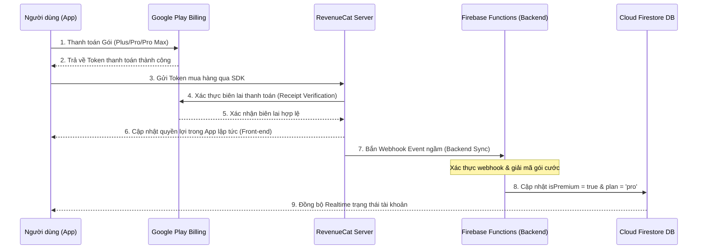

# ⏳ TimeSeal - Kế Hoạch Tích Hợp Đầy Đủ RevenueCat & Google Play Console (Front-end & Backend Sync)
## 📝 Tài liệu hướng dẫn tích hợp trọn vẹn từ thiết lập Store đến đồng bộ Cơ sở dữ liệu qua Webhook

Tài liệu này cung cấp kịch bản tích hợp **Full-stack** toàn diện để kết nối **Google Play Console**, **RevenueCat Dashboard**, **React Native Front-end**, và **Firebase Cloud Functions (Backend)** nhằm đồng bộ trạng thái Premium tự động, bảo mật và tức thời.

---

## 🗺️ Quy Trình Tích Hợp Tổng Quan (Architecture Flow)



---

## 📑 PHẦN 1: Cấu Hình Trên Google Play Console
Để RevenueCat có thể thay mặt ứng dụng nói chuyện với Google và xác thực các giao dịch mua hàng, bạn cần thiết lập các bước sau:

### 1. Đồng bộ Package Name & Tạo sản phẩm
1.  Đảm bảo mã gói ứng dụng (Package Name) của bạn trên Google Play trùng khớp hoàn toàn với package name của hệ thống (ví dụ: `com.timeseal`).
2.  Truy cập **Sản phẩm (Products)** $\rightarrow$ **Gói đăng ký (Subscriptions)**.
3.  Tạo **3 gói đăng ký** tương ứng với 3 ID cước:
    *   `timeseal_plus_monthly` (Gói Plus)
    *   `timeseal_pro_monthly` (Gói Pro)
    *   `timeseal_promax_monthly` (Gói Pro Max)
4.  Cấu hình giá tiền, chu kỳ thanh toán (hàng tháng) và chuyển trạng thái các gói sang **Hoạt động (Active)**.

### 2. Thiết lập quyền truy cập cho RevenueCat (Quyết định thành bại)
Google Play yêu cầu RevenueCat đăng nhập bằng quyền của một **Tài khoản dịch vụ (Service Account)** để xác thực biên lai:
1.  Truy cập **Google Cloud Console** liên kết với tài khoản Play Console của bạn.
2.  Tạo một **Service Account** mới.
3.  Tạo và tải xuống **Khóa bảo mật dưới dạng tệp JSON (JSON Key file)**.
4.  Truy cập **Google Play Console** $\rightarrow$ **Người dùng và quyền (Users and Permissions)** $\rightarrow$ Mời email của Service Account vừa tạo ở trên với quyền **Quản trị viên / Tài chính (Admin / Financial permissions)**.

---

## 📑 PHẦN 2: Cấu Hình Trên RevenueCat Dashboard

### 1. Thiết lập ứng dụng Android
1.  Đăng nhập RevenueCat Dashboard $\rightarrow$ Chọn dự án **TimeSeal**.
2.  Tại phần **Project Settings** $\rightarrow$ **Apps** $\rightarrow$ **Add Android App**.
3.  Điền **Package Name** (`com.timeseal`) và tải tệp **JSON Key file** (từ bước Service Account của Google ở Phần 1) lên mục **Google Play JSON key**.

### 2. Thiết lập Sản phẩm & Quyền lợi (Products, Entitlements & Offerings)
1.  **Entitlements (Quyền lợi):** Tạo 3 Entitlements ID đại diện cho các gói năng lực:
    *   `plus` (Mở khóa gói Plus)
    *   `pro` (Mở khóa gói Pro)
    *   `pro_max` (Mở khóa gói Pro Max)
2.  **Products:** Tạo sản phẩm trên RevenueCat và liên kết trực tiếp với Product ID trên Google Play Console:
    *   Sản phẩm `timeseal_plus` liên kết với `timeseal_plus_monthly`
    *   Sản phẩm `timeseal_pro` liên kết với `timeseal_pro_monthly`
    *   Sản phẩm `timeseal_promax` liên kết với `timeseal_promax_monthly`
3.  Gắn các Products tương ứng vào các Entitlements đã tạo.
4.  **Offerings:** Tạo 1 Offering tên là `default` (Đặt làm *Current*). Trong Offering này tạo 3 Package:
    *   `$rc_monthly` (Gói tháng) của Plus.
    *   `$rc_monthly` (Gói tháng) của Pro.
    *   `$rc_monthly` (Gói tháng) của Pro Max.

---

## 📑 PHẦN 3: Tích Hợp Front-End SDK (React Native)

Mã nguồn Front-end đã có sẵn các primal UI và logic. Bạn chỉ cần đảm bảo quá trình gọi mua hàng diễn ra như sau:

### 1. Khởi tạo SDK khi đăng nhập thành công
Tại file khởi chạy hoặc hook đăng nhập (`src/store/authStore.ts` hoặc `App.tsx`):
```typescript
import Purchases from 'react-native-purchases';
import { getRevenueCatApiKey } from './config/revenuecat';

// Sau khi người dùng đăng nhập thành công
const configureRevenueCat = async (userId: string) => {
  const apiKey = getRevenueCatApiKey();
  if (apiKey) {
    // Định danh người dùng trên RevenueCat bằng UID của Firebase
    await Purchases.configure({ apiKey, appUserID: userId });
  }
};
```

### 2. Gọi mua hàng trong Premium Modal
Tại màn hình mua hàng (`PremiumModal.tsx`):
```typescript
import Purchases, { PurchasesPackage } from 'react-native-purchases';

const handlePurchase = async (pack: PurchasesPackage) => {
  try {
    setIsLoading(true);
    // Kích hoạt thanh toán qua Google Play
    const { customerInfo } = await Purchases.purchasePackage(pack);
    
    // Kiểm tra quyền lợi tương ứng được kích hoạt chưa
    if (customerInfo.entitlements.active['pro'] !== undefined) {
      // Người dùng đã thanh toán gói PRO thành công
      Alert.alert('Thành công', 'Cảm ơn bạn đã nâng cấp lên gói Pro!');
    }
  } catch (e: any) {
    if (!e.userCancelled) {
      Alert.alert('Lỗi thanh toán', e.message);
    }
  } finally {
    setIsLoading(false);
  }
};
```

---

## 📑 PHẦN 4: Tích Hợp Backend Sync (Firebase Cloud Functions Webhook)

> [!IMPORTANT]
> **Tại sao cần Backend Sync?**
> Nếu chỉ đồng bộ bằng Front-end, kẻ xấu có thể can thiệp sửa đổi dữ liệu Firestore hoặc nếu người dùng gia hạn/hủy gói trong lúc tắt app, trạng thái Premium sẽ không được cập nhật. Cấu hình Webhook đảm bảo Firestore luôn đồng bộ thời gian thực theo máy chủ RevenueCat!

### 1. Viết mã nguồn Firebase Cloud Function Webhook
Tạo một endpoint HTTP ngầm trong Firebase Cloud Functions (ví dụ bằng Node.js / TypeScript):

```typescript
import * as functions from 'firebase-functions';
import * as admin from 'firebase-admin';

if (!admin.apps.length) {
  admin.initializeApp();
}

const db = admin.firestore();

/**
 * Endpoint lắng nghe mọi sự kiện giao dịch từ RevenueCat
 */
export const revenuecatWebhook = functions.https.onRequest(async (req, res) => {
  // 1. Xác thực Webhook bảo mật (Để tránh kẻ gian giả mạo gói tin)
  const authHeader = req.headers.authorization;
  const SECRET_TOKEN = 'Bearer YOUR_REVENUECAT_WEBHOOK_SECRET_KEY'; // Đặt một mã bí mật
  
  if (!authHeader || authHeader !== SECRET_TOKEN) {
    res.status(401).send('Unauthorized');
    return;
  }

  const event = req.body.event;
  if (!event) {
    res.status(400).send('Bad Request');
    return;
  }

  const userId = event.app_user_id; // UID người dùng bên Firebase
  const eventType = event.type;      // Loại sự kiện (INITIAL_PURCHASE, RENEWAL, CANCELLATION, v.v.)
  const entitlements = event.entitlements || []; // Danh sách quyền lợi active

  // 2. Xác định gói cước hiện tại của người dùng
  let currentPlan = 'free';
  let isPremium = false;

  // Duyệt qua danh sách entitlement đang hoạt động của người dùng
  for (const ent of entitlements) {
    const entId = ent.id; // pro, plus hoặc pro_max
    const expiresDateMs = ent.expires_date_ms;
    
    // Nếu chưa hết hạn
    if (!expiresDateMs || expiresDateMs > Date.now()) {
      isPremium = true;
      currentPlan = entId; // Cập nhật gói cao nhất đang sở hữu
    }
  }

  try {
    // 3. Cập nhật trực tiếp trạng thái vào Firestore của người dùng
    const userRef = db.collection('users').doc(userId);
    await userRef.set(
      {
        isPremium,
        plan: currentPlan,
        premiumUpdatedAtISO: new Date().toISOString(),
        // Lưu vết lịch sử sự kiện từ RevenueCat để dễ đối soát
        subscriptionMeta: {
          lastEventType: eventType,
          lastUpdated: admin.firestore.FieldValue.serverTimestamp(),
          originalPurchaseDate: event.original_purchase_date_ms || null,
        }
      },
      { merge: true }
    );

    console.log(`Successfully synced subscription for User: ${userId} to Plan: ${currentPlan}`);
    res.status(200).send('OK');
  } catch (error) {
    console.error('Error syncing RevenueCat webhook to Firestore:', error);
    res.status(500).send('Internal Server Error');
  }
});
```

### 2. Đăng ký Webhook trên RevenueCat Dashboard
1.  Triển khai Cloud Function của bạn lên Firebase (`firebase deploy --only functions`).
2.  Sau khi deploy thành công, bạn sẽ nhận được một đường dẫn URL công khai (ví dụ: `https://us-central1-timeseal.cloudfunctions.net/revenuecatWebhook`).
3.  Truy cập **RevenueCat Dashboard** $\rightarrow$ **Integrations** $\rightarrow$ **Webhooks**.
4.  Chọn **Add Webhook** $\rightarrow$ Dán đường dẫn URL trên vào ô **Webhook URL**.
5.  Tại ô **Authorization header**, điền mã bí mật của bạn: `Bearer YOUR_REVENUECAT_WEBHOOK_SECRET_KEY`.
6.  Chọn tích nghe các sự kiện: `Initial Purchase`, `Renewals`, `Cancellations`, `Billing Issues`, `Expiration` để đảm bảo đồng bộ đầy đủ vòng đời gói cước!
